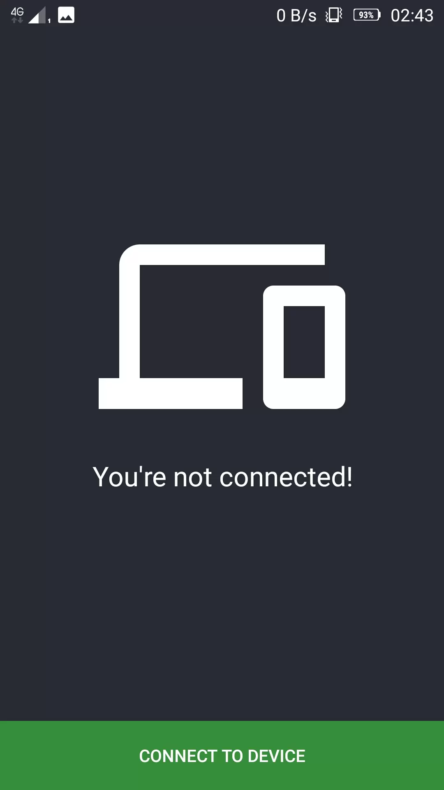

# 

21Connect App is an Android application to install on your mobile device to help you connect it to your PC. 

Install the [Windows](https://github.com/tsvetilian-ty/21Connect/releases) desktop application on your PC and scan the qrcode from it!

[Android App](https://github.com/tsvetilian-ty/21Connect-Android-App)

[Download for Windows Desktop](https://github.com/tsvetilian-ty/21Connect/releases)

## Contents

- [Usage](#usage)
- [Screenshots](#screenshots)
- [License](LICENSE.md)

## Usage

* Click on "Connect to device" button to start the code reader, than just scan the Qrcode from your Desktop application.

* You can stop/start the notification at any time by clicking "Sync Enabled" or "Sync Disabled" buttons respectively

## Screenshots

